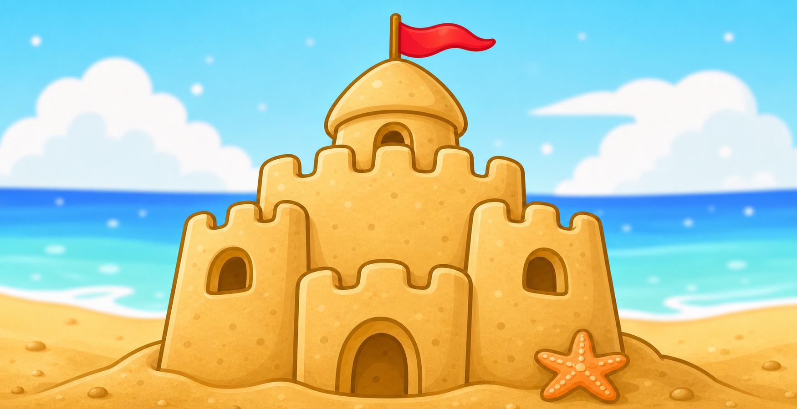
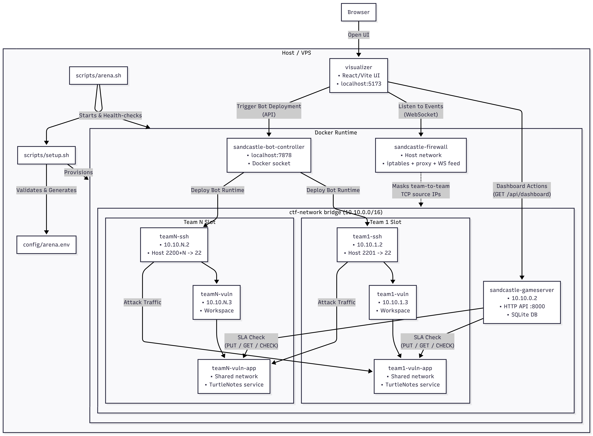
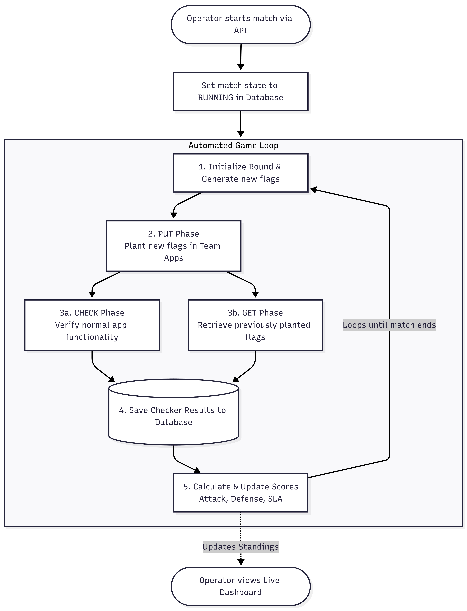
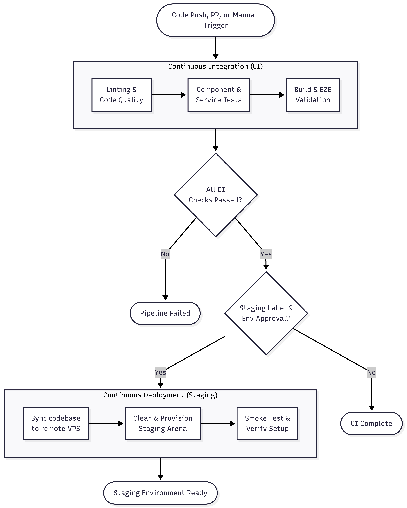
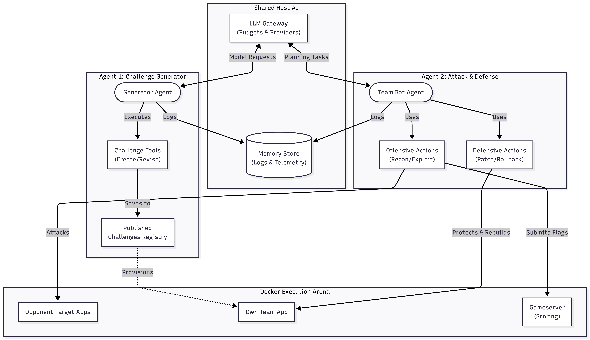

# Sandcastle

[](https://github.com/Matteoverzotti/Sandcastle/actions/workflows/ci.yml)
[](https://sandcastle.matteoverz.xyz/)
[](LICENSE)


<p align="center">
  
</p>


[Presentation Video](https://youtu.be/LhUOnPaAk6E)

Sandcastle is a local, Docker-based Attack and Defense CTF arena for testing
autonomous software agents in a realistic security game loop.

It gives every team a mutable Linux workspace, an intentionally vulnerable
service, stable network targets, checker-driven rounds, authenticated flag
submission, deterministic scoring, a live operator console, and an AI Lab for
challenge generation and attack/defense agents.

The project is built for experiments where agents must do more than solve a
static puzzle. They have to inspect unfamiliar code, patch their own service,
keep it alive, attack opponents, submit flags, and operate inside clear
infrastructure and credential boundaries.

> [!NOTE]
> This project has been implemented using agentic AI. See the development
> process report in [AI-assisted development](docs/ai-assisted-development-report.md).

## Live Deployment

The current public staging deployment is available at
[sandcastle.matteoverz.xyz](https://sandcastle.matteoverz.xyz/).

Staging is disposable and PR-driven. It is intended for validating the operator
console, routing, generated challenges, and bot-controller workflows against a
real VPS deployment before merging. The deployment path is documented in
[Staging deployments](docs/staging-deploy.md).

## Quickstart

Requirements:

- Linux host with Docker Engine and the Docker Compose plugin.
- Python 3.12 for backend scripts and tests.
- Node.js 22 for the visualizer build.

Generate the local arena and start it:

```bash
./scripts/setup.sh
./scripts/arena.sh up
./scripts/arena.sh status
```

Open the visualizer at
[http://127.0.0.1:4173](http://127.0.0.1:4173).

For operator credentials, team SSH access, bot commands, and troubleshooting,
see the [Operator guide](docs/operator-guide.md).

## What Sandcastle Provides

- A reproducible multi-team CTF arena generated from `config/arena.env`.
- Per-team SSH gateways, vulnerable machines, and service containers.
- A persistent gameserver for matches, rounds, flags, submissions, scoring, and
  recovery.
- Typed service checkers with PUT, GET, and CHECK operations.
- Deterministic attack, defense, and SLA score events.
- A firewall/proxy layer for team-to-team traffic visibility and source
  masking.
- A React visualizer for match control, scoreboard, topology, traffic events,
  bot deployment, and AI agent workflows.
- Scripted bots and model-backed attack/defense agents with bounded planning,
  scoped credentials, redacted memory, and telemetry.
- A challenge generation path where models select registered tools while local
  code performs rendering, validation, and publication.

## Why It Exists

Sandcastle is an experimentation platform for agentic software engineering in
security-heavy environments. It is designed to explore questions like:

- Can an agent patch a vulnerable service without breaking its checker?
- Can an agent defend its own system while attacking changing opponents?
- Can model-driven tools be useful when execution is typed, bounded, audited,
  and isolated from provider credentials?
- Can CTF infrastructure produce replayable evidence for scoring, behavior, and
  cost?

## General Overview

### Infrastructure Architecture

The deployment view shows how the host, Docker runtime, gameserver, firewall,
visualizer, bot controller, and repeated team slots fit together.

<p align="center">
  
</p>

### Round Flow

The round flow follows one scoring cycle from flag creation through checker
operations, persisted results, score reconciliation, and dashboard updates.

<p align="center">
  
</p>

### CI/CD And Staging

The CI/CD view summarizes the required quality gates and the label-gated
staging deployment path to a disposable VPS arena.

<p align="center">
  
</p>

### AI Agents

The agents view shows the split between challenge generation, attack/defense
planning, provider gateways, scoped credentials, memory, and team-local tools.

<p align="center">
  
</p>

Agent behavior is proved through contract tests for model requests, tool-call
validation, deterministic fake-provider loops, budgeted provider smoke checks,
and staging evals that run the full arena path end to end. See
[Agent testing and evals](docs/agent-testing-evals.md) for the detailed
validation model.

## Project Map

| Area | Purpose |
|---|---|
| `gameserver/` | Match state, rounds, flags, submissions, scoring, checkers, and APIs. |
| `visualizer/` | Operator UI, scoreboard, topology view, bot controls, and AI Lab. |
| `bot/` | Scripted bot runtime, deployment controller, model planning, agent memory, and defensive tooling. |
| `firewall/` | Transparent proxy and activity feed for team-to-team traffic. |
| `services/example-vuln/` | Bundled vulnerable Flask service, checker, and reference exploits. |
| `scripts/` | Arena setup, lifecycle, doctor, smoke tests, cleanup, and staging helpers. |
| `docs/` | Architecture, threat model, scoring, round engine, isolation, staging, and authoring guides. |
| `diagrams/` | High-level system diagrams used in this README. |

## Development Checks

Common local validation commands:

```bash
docker compose config --quiet
python3 -B tests/gameserver_test.py
python3 -B tests/agent_plan_api_test.py
python3 -B tests/openai_provider_test.py
./tests/staging_deploy_test.sh
```

The full fast suite is available through:

```bash
./scripts/run-tests.sh --fast
```

When `config/arena.env` changes, regenerate and commit the generated Compose
file:

```bash
./scripts/setup.sh
git diff -- docker-compose.yml config/arena.env
```

CI enforces that `docker-compose.yml` stays in sync with
`config/arena.env`.

## Deployment And Secrets

Staging deploys are managed by GitHub Actions and the `deploy:staging` pull
request label. The workflow checks out the PR head, syncs it to the VPS, applies
staging-only arena configuration, runs a Docker-in-Docker smoke deployment, and
leaves a live arena running for review.

Provider keys are never committed. For model-backed challenge generation and AI
agents, configure these GitHub environment secrets for staging:

| Secret | Purpose |
|---|---|
| `OPENAI_API_KEY` | Enables OpenAI-backed challenge generation and agents. |
| `GEMINI_API_KEY` | Enables Gemini-backed challenge generation and agents. |
| `STAGING_OPERATOR_TOKEN` | Authorizes match controls in the operator console. |
| `STAGING_CHECKER_SECRET` | Master secret used by service checkers. |
| `STAGING_TEAM_TOKEN_PATTERN` | Per-team submission token pattern containing `{team}`. |

The bot controller only receives provider keys through container environment
variables at deploy time. If a provider appears as `key not detected` in the UI,
inspect the staging workflow secrets and the `bot-controller` runtime
environment.

## Documentation

- [Operator guide](docs/operator-guide.md) - local setup, arena lifecycle,
  team access, bots, troubleshooting, and development checks.
- [Architecture](docs/architecture.md) - container topology, generated
  services, persistence, submissions, scoring, and operator console behavior.
- [Threat model](docs/THREAT_MODEL.md) - trust boundaries, privileged
  resources, escape paths, and controls for shared or exposed events.
- [Round engine](docs/round-engine.md) - match controls, persisted rounds,
  checker phases, recovery, and single-step behavior.
- [Scoring](docs/scoring.md) - attack, defense, SLA, replay, idempotency, and
  tie ordering.
- [Isolation](docs/isolation.md) - trusted, filtered-proxy, and Docker-in-Docker
  operating modes.
- [Agent testing and evals](docs/agent-testing-evals.md) - how model contracts,
  fake-provider loops, smoke checks, and staging evals prove agent behavior.
- [AI-assisted development](docs/ai-assisted-development-report.md) - report on
  how agentic AI tools were used during the software development process.
- [Writing checkers](docs/writing-checkers.md) - checker plugin contract and
  service authoring expectations.
- [Staging deployments](docs/staging-deploy.md) - PR-label-gated deployment to
  the disposable staging VPS.
- [Product direction](VISION.md) - long-term goals and product framing.
- [Audit and backlog](docs/PROJECT_AUDIT_AND_BACKLOG.md) - current priorities
  and agent-oriented implementation tasks.

## Status And Safety

Sandcastle is a local research and prototyping platform. Native Linux Docker
Engine is the best supported runtime, and Docker-in-Docker mode is the current
production-like option for untrusted participants.

Before running a shared, public, or cloud-exposed event, read the
[threat model](docs/THREAT_MODEL.md). The default trusted-local mode is meant
for controlled development environments, not as a security boundary.

## License

Sandcastle is released under the MIT License. See [LICENSE](LICENSE).
