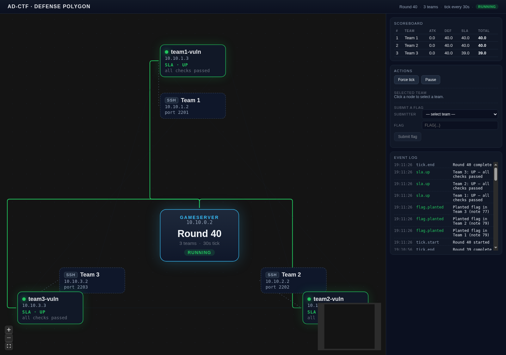
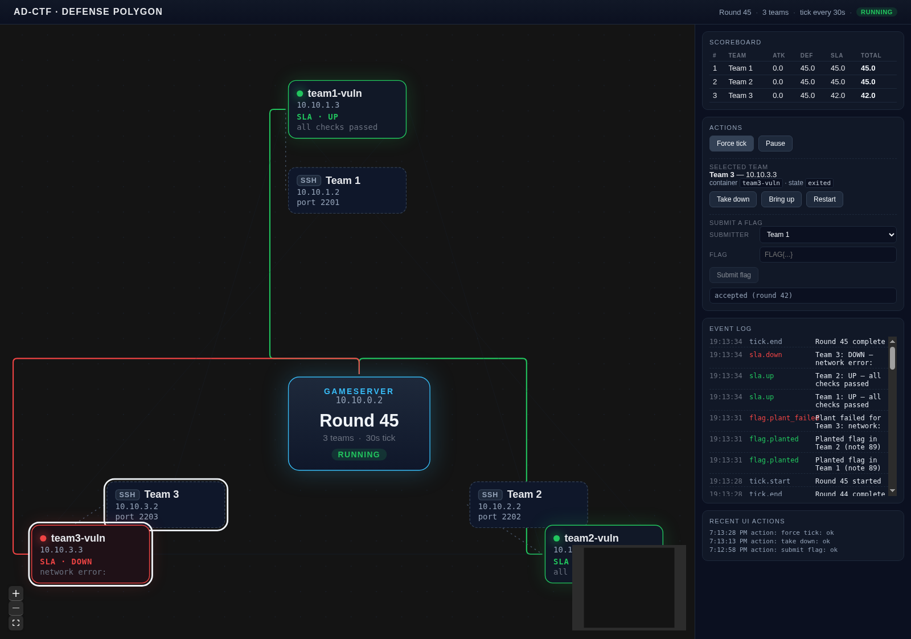

# Local AD-CTF Simulation

A self-contained, Docker-only simulation of an Attack & Defense CTF: a central
**gameserver** (round/flag/scoring engine), N **team boxes** (SSH gateway +
vulnerable web service), and a **React + React-Flow dashboard** that visualises
the polygon and lets an operator drive it.

It implements the design described in `LOCAL_AD_CTF_SIMULATION.md`:

- A flat `10.10.0.0/16` Docker bridge network (no VPN).
- A periodic **tick engine** that plants flags via the service's own API,
  runs SLA checks, expires old flags, and updates scores.
- Per-team **vulnerable service** (a notes app with an intentional IDOR
  on `GET /api/notes`) — anyone on the network can read every team's notes
  and harvest the round's flag.
- Per-team **SSH gateway** with the host Docker socket mounted, so a team can
  rebuild and redeploy their own service from inside the SSH session.
- A REST API on `http://localhost:8080` for both participants (flag
  submission) and operators (pause / force tick / take services up & down).



## Layout

```
ad-ctf-sim/
├── docker-compose.yml          # generated by scripts/gen_compose.py
├── scripts/
│   ├── gen_compose.py          # parameterised compose generator
│   ├── setup.sh                # generate compose for N teams
│   ├── start.sh                # build + up
│   ├── stop.sh                 # down (keeps volumes)
│   └── reset.sh                # down -v + start (full reset)
├── gameserver/                 # FastAPI gameserver (tick engine + REST API)
│   ├── Dockerfile
│   ├── requirements.txt
│   └── app/
│       ├── main.py             # API + lifespan
│       ├── tick.py             # async tick engine
│       ├── planter.py          # flag planter (Service API method)
│       ├── checker.py          # SLA checker
│       ├── scoring.py          # per-round + cumulative scoring
│       ├── teams.py            # team registry + IP/container lookup
│       ├── docker_admin.py     # docker-socket-driven team admin
│       ├── db.py               # SQLite schema + helpers
│       └── config.py           # env-var driven config
├── services/notes-service/     # vulnerable Flask notes app (IDOR)
│   ├── Dockerfile
│   ├── requirements.txt
│   └── app.py
├── teams/ssh/                  # per-team SSH gateway image
│   └── Dockerfile
├── dashboard/                  # Vite + React 19 + @xyflow/react UI
│   ├── package.json
│   ├── vite.config.ts
│   └── src/
│       ├── App.tsx             # layout, polling, flash effects
│       ├── api.ts              # gameserver REST client
│       ├── types.ts
│       ├── flow/
│       │   ├── PolygonFlow.tsx # the React-Flow canvas
│       │   ├── nodes.tsx       # gameserver / SSH / vuln node types
│       │   └── layout.ts       # circular layout maths
│       └── components/
│           ├── Scoreboard.tsx
│           ├── EventLog.tsx
│           └── ActionPanel.tsx
└── docs/
    ├── screenshots/
    └── architecture.md         # this file's deeper companion
```

## Quick start

### Requirements

- Docker 24+ with the `docker compose` plugin
- Python 3 (only used to generate the compose file; no host venv required)
- Node.js 20+ and Yarn (only for the dashboard dev server)

### 1. Generate compose & bring everything up

```bash
# default: 3 teams
./scripts/setup.sh
./scripts/start.sh
```

`start.sh` builds all images and runs `docker compose up -d`. Once the
gameserver health check turns green you should see all 3 + 1 + 3 containers
healthy (`docker ps`).

To run with a different team count:

```bash
./scripts/setup.sh 5     # writes a new docker-compose.yml for 5 teams
./scripts/start.sh
```

### 2. Sanity-check the gameserver

```bash
curl -s http://localhost:8080/api/state | jq .round
# → 1   (or higher; ticks are 30 s by default)
```

### 3. Run the dashboard

```bash
cd dashboard
yarn install
yarn dev
# → http://localhost:5173
```

The Vite dev server proxies `/api/*` to `http://localhost:8080` so the
dashboard talks to the gameserver from the browser without CORS gymnastics.

The dashboard polls `/api/state` every 2 s and re-renders the polygon, the
scoreboard, and the recent events log live.

### 4. Tear down

```bash
./scripts/stop.sh         # keeps volumes (gameserver DB persists)
./scripts/reset.sh        # wipes volumes and rebuilds everything
```

## What the dashboard shows



- **Centre**: the gameserver node — current round, paused/running, tick
  cadence, team count, docker-socket availability indicator.
- **Around the ring**: one **vulnerable-service node** + one **SSH-gateway
  node** per team. The vuln node's border colour reflects its SLA status:
  - <span style="color:#22c55e">green</span> `UP` — all checks passing
  - <span style="color:#eab308">yellow</span> `MUMBLE` — service responds but
    canary read failed (logical corruption)
  - <span style="color:#f97316">orange</span> `CORRUPT` — SLA passed but the
    most recently planted flag is missing
  - <span style="color:#ef4444">red</span> `DOWN` — service unreachable
- **Edges**: bright edges from the gameserver to each vuln service light up
  briefly at every tick (visualising the plant + SLA round-trip), and turn
  red when SLA is failing. Faint dashed edges from each SSH gateway to that
  team's vuln node represent a participant's local management connection.
  Very faint cross-team edges hint at the attack mesh.
- **Scoreboard** (top-right): cumulative attack / defence / SLA / total
  per team, sorted by total.
- **Action panel**: force tick, pause/resume, plus per-team take-down /
  bring-up / restart and a flag-submission widget keyed by submitter
  team-token.
- **Event log**: a colour-coded stream of `tick.start`, `flag.planted`,
  `flag.captured`, `sla.up/down/mumble/corrupt`, `container.stopped/started`
  …

## Gameserver REST API

| Method | Path                                   | Purpose                                           |
|-------:|----------------------------------------|---------------------------------------------------|
|   GET  | `/api/state`                           | Full snapshot: round, teams, scoreboard, events. |
|   GET  | `/api/scoreboard`                      | Cumulative scoreboard.                            |
|   GET  | `/api/events?limit=100`                | Recent events (newest first).                     |
|   GET  | `/api/teams`                           | Team registry (id, IP, ports, submission tokens). |
|  POST  | `/api/submit`                          | `{ team_token, flag }` — submit an attack flag.   |
|  POST  | `/api/admin/tick`                      | Force the next tick to run immediately.           |
|  POST  | `/api/admin/pause` / `…/resume`        | Pause or resume the tick engine.                  |
|  POST  | `/api/admin/team/{id}/down`            | `docker stop` that team's vulnerable service.     |
|  POST  | `/api/admin/team/{id}/up`              | `docker start` it again.                          |
|  POST  | `/api/admin/team/{id}/restart`         | `docker restart`.                                 |

## Demonstrating an attack end-to-end (the "happy path")

The bundled vulnerable service has an intentional **IDOR** on
`GET /api/notes` — it returns every user's notes, including the round's
freshly-planted flag.

```bash
# 1. Read teams + tokens
curl -s http://localhost:8080/api/state | jq '.teams[0,1] | {id,name,token: .submission_token, vuln: .service_url}'

# 2. From any container in the network, scrape Team 2's flag.
docker exec team1-vuln curl -s http://10.10.2.3:8080/api/notes
# → [{"id":1,"title":"round 1 secret","content":"FLAG{...}", ...}, ...]

# 3. Submit it as Team 1
curl -s -X POST http://localhost:8080/api/submit \
   -H 'Content-Type: application/json' \
   -d '{"team_token":"<team-1-token>","flag":"FLAG{...}"}'
# → {"status":"accepted","round":N}
```

The dashboard's "Submit a flag" panel does exactly this from the browser.

## How a participant interacts

Each team gets an SSH login on `localhost:220<N>`:

```bash
ssh -p 2201 ctfuser@localhost      # password team1pass
```

Inside, the `motd` explains the basics and `/home/ctfuser/service` is a
read-only mount of the vulnerable service source. Because the SSH gateway
mounts the host's Docker socket, the team can patch their service code in
their home directory and rebuild the running container:

```bash
docker compose --project-directory /home/ctfuser/service \
    -f /home/ctfuser/service/docker-compose.team.yml \
    up -d --build
```

(For brevity the bundled compose only generates the per-team containers; in a
real exercise you'd bind-mount a writable copy of the service source and
generate a per-team `docker-compose.team.yml`. That's a thin extension on
top of `scripts/gen_compose.py`.)

## Configuration

The gameserver reads its config from environment variables (see
`gameserver/app/config.py`):

| Variable                 | Default | Notes                                            |
|--------------------------|---------|--------------------------------------------------|
| `NUM_TEAMS`              | `3`     | Must match the number of team services.          |
| `TICK_DURATION`          | `30`    | Seconds between scoring ticks.                   |
| `FLAG_EXPIRY_ROUNDS`     | `5`     | Flags expire after N rounds (typical AD value).  |
| `SUBNET`                 | `10.10` | Network prefix; teams live on `<prefix>.N.0/24`. |
| `DB_PATH`                | `/app/data/gameserver.sqlite` | Persistent volume in compose.   |

Per-team SSH password defaults to `team<N>pass` and is set in
`scripts/gen_compose.py`.

## Implementation notes

### Tick engine (`gameserver/app/tick.py`)
1. Increment round, emit `tick.start`.
2. **Plant flags in parallel** — for each team: register a bot user on that
   team's notes service, POST a note with `FLAG{<32-hex>}`, store the flag
   in SQLite linked to `(team_id, round, note_id)`.
3. **SLA-check in parallel** — for each team:
   1. `GET /health` (reachability)
   2. register a canary user, POST a canary note, `GET /api/note/<id>` —
      verify the content matches.
   3. if a flag was planted this round, `GET /api/note/<flag_note_id>` and
      verify the flag string is intact.
4. Mark expired flags (`round + FLAG_EXPIRY_ROUNDS <= current_round`).
5. Compute per-team per-round scores: `total = (attack + defense) × SLA_mult`
   where `SLA_mult ∈ {UP: 1.0, MUMBLE/CORRUPT: 0.5, DOWN: 0.0}`.
6. Emit `tick.end`.

If the tick is paused, the loop emits `tick.skip` instead.

### SLA states (`gameserver/app/checker.py`)
- `UP`     — all three checks pass.
- `MUMBLE` — service is reachable but the canary write/read round-trip
  produced wrong content (e.g. an attacker patched the service to lie).
- `CORRUPT`— canary works, but the latest planted flag is gone. The team
  destroyed the flag store while patching.
- `DOWN`   — network unreachable / 5xx / hung.

### Submission rules
- The flag must match `^FLAG\{[a-f0-9]{32}\}$`.
- Submitter must be a registered team (matched by `team_token`).
- A team cannot submit its own flag (`403`).
- The flag must currently be **active** (not expired) (`410`).
- Each `(submitter, flag)` pair can only score once (`409` on duplicates).

### Docker admin (`gameserver/app/docker_admin.py`)
The gameserver mounts the host docker socket read-only (compose entry below)
and uses the docker engine API to start/stop/restart the per-team
`team<N>-vuln` containers when the operator clicks the take-down buttons.
This is also how the dashboard's `vuln_state` field is populated.

## Tested scenarios

All exercised locally before packaging:

- ✅ `docker compose build` and `up -d` succeed; all 7 containers healthy.
- ✅ `GET /api/state` returns expected schema; `round` advances every 30 s.
- ✅ Flag-planting succeeds for every team every tick (verified via
  `flag.planted` events and the team's notes API).
- ✅ SLA checker correctly classifies `UP` and `DOWN` (confirmed by stopping
  team-3 via `/api/admin/team/3/down` and watching SLA flip).
- ✅ Cross-team attack flow: scrape via IDOR + `POST /api/submit` accepted;
  duplicates → `409`, own-flag → `403`, malformed → `400`.
- ✅ Dashboard polls live state, renders the polygon, and the action panel
  drives every gameserver endpoint successfully (force-tick, pause, take
  down / bring up, submit flag).
- ✅ When a team goes `DOWN` the dashboard turns the corresponding edge red
  and the vuln node border red within one tick; bringing it back up restores
  green within the next tick.

## License & purpose

This is intended as a self-contained training/teaching artifact and not a
hardened competition platform. It deliberately exposes the SSH gateway with
a known password and mounts the docker socket — do not run on untrusted
networks.
